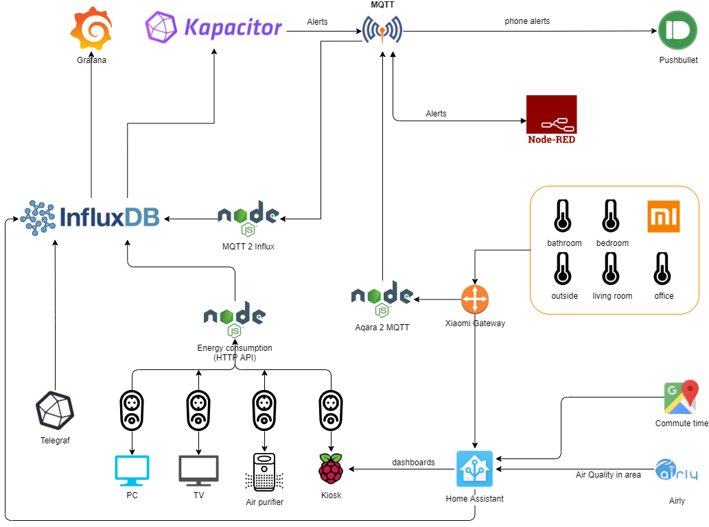

# Home

Simplified diagram of my home infrastructure:

# Introduction

The idea behind all that was evolving slowly. Some of that has been already working years ago, other things were added later.  
Why all that? I have a weakness which I cannot resist. It's the numbers. I simply love them. Graphs representing those numbers? Even better. I can't live without it :D  
Luckily I'm a software developer so it's pretty easy to do most of that stuff. However the idea was to use as much out of the box solutions as possible. Some times I may have failed with that but I'm not an expert in IoT world and definitely don't know all the tools. I only knew **InfluxDB** and **Grafana** at the beginning and those were the very first components.

Quite recently I have introduced **Home Assistant** as it provides a way to have some cool dashboards and is really extensible. I do have a Raspberry Pi based Kiosk in the living room and it's basically cycling several different dashboards during the day. It sleeps at night because the screen was so bright I could see it in our bedroom casting light on the wall (8-10 meters away).

# Data collection

**InfluxDB** is my primary storage and **Home Assistant** serves as secondary storage for dashboards (short term). However not everything can be collected directly to **InfluxDB**. Some data comes directly from **Telegraf** collecting sys info from multiple machines. Other data goes around using various scripts/tools which I'll try to describe one by one.
It may not be all consistent with each other as all that stuff took few years to complete and when I was introducing some enhancements in newer components there wasn't always time to update older components. Additionally it was an open playground for me to play with different tools and have some fun so sometimes it was conscious decision to do something differently. Ok, enough excuses, let's get to the point.

## System info

For basic system information data like CPU, memory, disks, docker containers and several more I use **Telegraf** because it's just built-in and does not require any additional effort. It runs on my *Intel NUC* which is the main server (Debian) and also on my desktop machine.

## Energy consumption

I'm using **TP-Link HS 110** smart plugs to measure power consumption from selected devices.  
Why this specific smart plug? Well.. because it's so open. It has HTTP API which has been already reverse engineered long time ago and so doesn't need any hardware modifications to be able to process that data.  
I'm using [this](https://www.npmjs.com/package/tplink-smarthome-api) library to read data but there are many others on the market.

Since there is no straightforward way to get that data to **InfluxDB** I decided to write a simple node.js script to do that on regular basis. It's executed every minute from cron for all plugs.

> Note: Script to be published - it has some private dependencies which I have to resolve first

Why cron?  

I think I was using **Telegraf** and `[[inputs.exec]]` at the beginning but then I switched to **Docker** for as much as I can and my **Telegraf** instance is running from a container which makes it little harder to integrate. Not impossible but still. Cron was a quick win back then and it's already *in production* for few years.

## Aquara sensors

I do have quite a few **Xiaomi** sensors which are still based on the original **Xiaomi** gateway but I already have a *zigbee2mqtt* in da house.  
It can be opened to local network so that the traffic from the sensors can be listened. You can find how to do that [here](https://www.domoticz.com/wiki/Xiaomi_Gateway_(Aqara)#Adding_the_Xiaomi_Gateway_to_Domoticz).  
I'm using [aqara2mqtt](https://www.npmjs.com/package/aqara2mqtt) library to transfer the data to **MQTT** and then another simple script to make it to **InfluxDB**.

Those sensors are also directly integrated with **Home Assistant** for the dashboards but that's totally independent of the **InfluxDB** stack.

## Air quality sensors

We do have serious air quality issues in Poland last years. Since I'm an allergic I try to monitor that to know when I can open the windows safely and when I should rather not :)  
[Airly](https://airly.eu/en/) which I'm using to get data comes with out of the box **Home Assisant** integration so that was easy. It's on one of my dashboards displayed in the living room. Since **Home Assistant** is not my single source of truth I do transfer that data to **InfluxDB** using provided [integration](https://www.home-assistant.io/integrations/influxdb/).

## Commute

I do work remotly most of the time but still visiting the office on some days. The city I live in has substantial traffic so I decided to make a dashboard out of that data as well :) I only use it in the morning so that dashboard cycles only in morning hours. 
**Google Maps API** to the rescue. That's more or less how it looks like:

Commute time is taken from both **Google Maps API** and **HERE Maps**. They usually differ by only a minute but when one goes down the other should still work. The data is pulled every 2 minutes but could do that more often. GCP and HERE quotas are more than enough for that.  
As before, **Home Assistant** is for the dashboards but for long term data I prefer **InfluxDB** so that is also pushed there to get something like this:
  
It's *Coronavirus* time now and one can clearly see when the quarantine has begun. Did I mention I like graphs already? :)

# Data presentation

**Grafana** was my tool of choice since the very beginning. I first got to know it around 2014-2015. Our *IT ops* were using it back in the days. I've also seen **Kibana** but **Grafana** had one advantage over it. It was looking really good out of the box (dark mode FTW). It also plays really well with **InfluxDB** data source. I do store most of the data for about a year (most with minute precision) and it's still very fast.
Nothing special to write here. Using some prebuilt dashboards there for common data (sys info, docker, etc.). For others (Xiaomi sensors, energy consumption) I have my own custom dashboards but nothing fancy.

# Alerting

What would data mean without alerts? Quite a lot for me since I like graphs but still.. some things should alert me when they happen.

I was struggling to find the best tool for the job. Since I'm already on **InfluxDB** stack **Kapacitor** was likely the best option and here we go. It's there. It wasn't like that since the beginning. I faced some issues when trying to define working TICKscripts using **Kapacitor** so I also have other measures for alerting. That involves **Node-RED** for few things which I can easily change without any code. There are also some custom scripts which are not reflected on the diagram becasue they're not directly related to the monitoring nature of this whole solution but still they're using shared **MQTT** topic to send notifications to my phone. Ok... there's one more script which subscribes to the topic(s) and sends that to **Pushbullet** which then sends notification to my phone.
At the time I was writing that script there was nothing free available which would fit my needs.  
Anyway I think I finally managed to get **Kapacitor** working so I might want to keep most alerts here as it's pretty powerful when it comes to defining rules based on time-based data.

# Logging

All right. That's pretty much stuff that can break. Indeed it is. I'm glad somebody invented ELK. Obviously I do use Docker to host it and I don't need Logstash to be honest. All logs are pushed directly to Elasticsearch using common library for all my scripts (that's the reason why they are not published yet - need some changes to make it more generic). Anyway all the things I do from my custom scripts are being logged. That means quite some logs every single minute. Despite that it only takes 1 megabyte of logs daily which is good enough for me. It already saved me some time while troubleshooting what's going on.  
Kibana is just fine for that:

Of course that list can be filtered using all the power and goodnesd of Elasticsearch queries. However most common use is to see all errors/warnings. Surprisingly there are not many not counting those while developing. Usually brief connectivity problems from time to time.

Next step will be to alert about errors but that's nice to have only. Already picked a [lib](https://github.com/Yelp/elastalert) for that. 

# Questions?

If you have any questions let me know. This description does not cover everything, some things are missing. Feel free to ask about details. 
If you see anything that can be improved or simplified, let me know as well. Pretty please.  
Like I said at the beginning I'm no expert in that field. All of that is totally amateur job using tools I found. I'll be happy to take criticism and hopefully learn from it.

[Create issue](https://github.com/ipatalas/home/issues/new) for both questions or suggestions. 

# Disclaimer

By no means is that repository and all related scripts meant to be (re)used by anyone in his/her situation out of the box. It's been all dedicated to solve my particular needs at the time. Your needs may be different. I don't say it's not gonna work. It should when applied correctly but I don't provide any installation guide since there are too many components. I do have backups for as much as I can to be able to recover in case something breaks. Still, every infrastructure is different.  
Of course you don't need to be recreate everything I have, some things will work partially. I can assist if you really want to use something I use but can't guarantee full support.
That's basically meant to be an inspiration for others. I'm giving back what I got from many many other people/repositories. It was really inspiring and helped my build my system.  
As a matter of fact it's also meant to be a documentation for future myself in case I start forgetting things :)